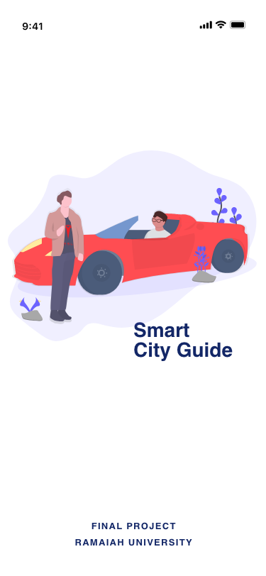
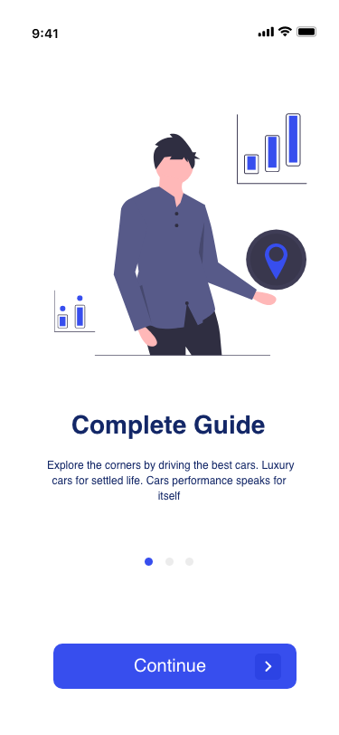
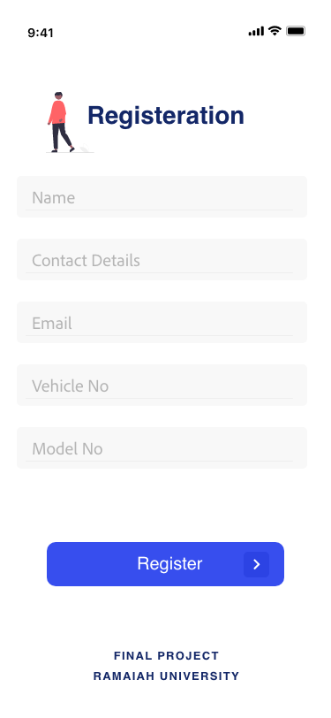
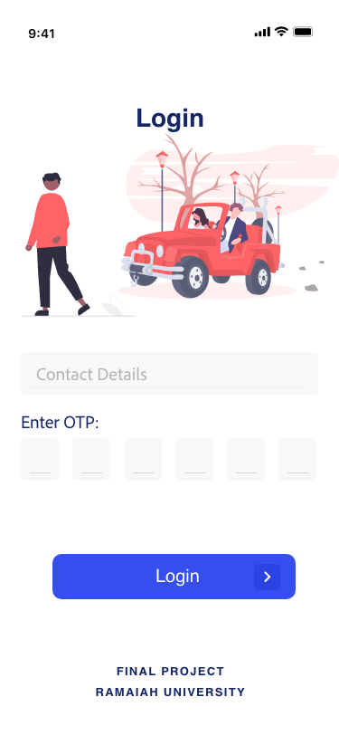
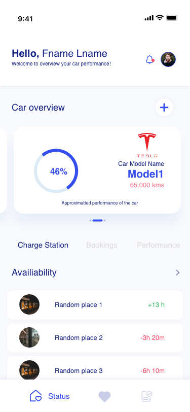
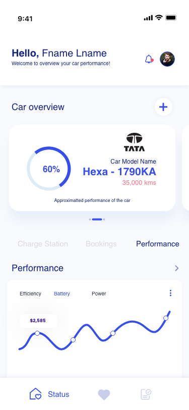

# **Ramaiah University of Applied Sciences!!** 

Final Project Report!!
=

Project based on Tensor Flow
===

### TEAM MEMBERS OF THE PROJECT

|Sl. No.    |   Reg. No.    |   Name of the Student         |   Git Id / Email Id       |
|-----      |------------   |---------------------------    |------------------------   |
|01         |17ETCS002138   |RAJAT KUMAR SINGH              |rajatkumar066@gmail.com    |
|02         |17ETCS002157   |SANOBAR SHAMIM                 |sanobarshamina5@gmail.com  |
|03         |17ETCS002027   |ANKIT ANAND                    |060096@gmail.com           |
|04         |17ETCS002089   |LAKSHYA CHANDRAKAR             |iam.lakshya123@gmail.com   |
|05         |17ETCS002304   |MANAS KUMAR GA                 |mk175823@gmail.com         |
|06         |17ETCS002096   |AVINASH PRAMESHWAR GORE        |avinashgore1995@gmail.com  |

---
# Content 
- List of Tables
- List of Tables

1. Introduction
2. Design

# **1. Introduction**

This project defines the working of smart city where the application allow user to plan their trip and also provide suggestion about charging station along with the time availiable to park your vehicle in that particular location.

# **2. Design**
|Start page |Intro page|Registration|
|-----------|----------|------------|
||||
|This contains the starting page of the applications

|Login page |User Terminal 1|User Terminal 2|
|-----------|----------|------------|
||||